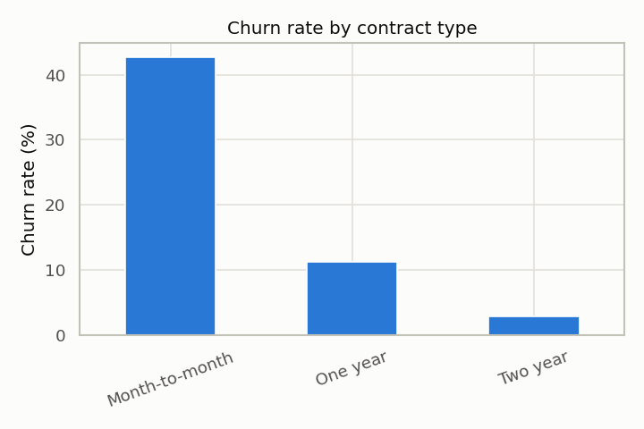
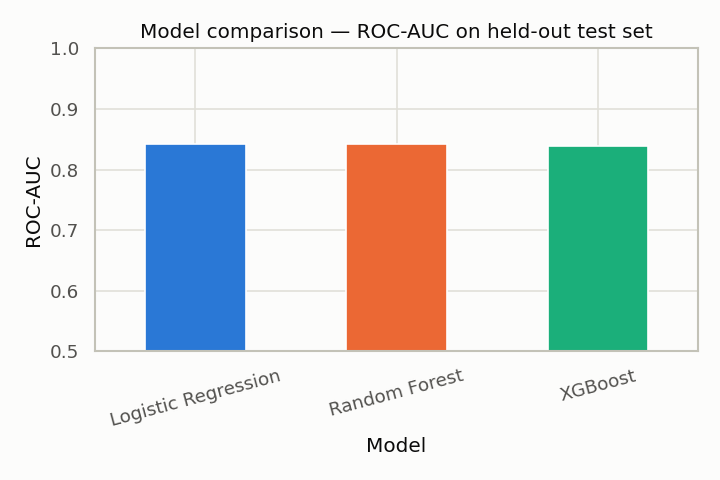
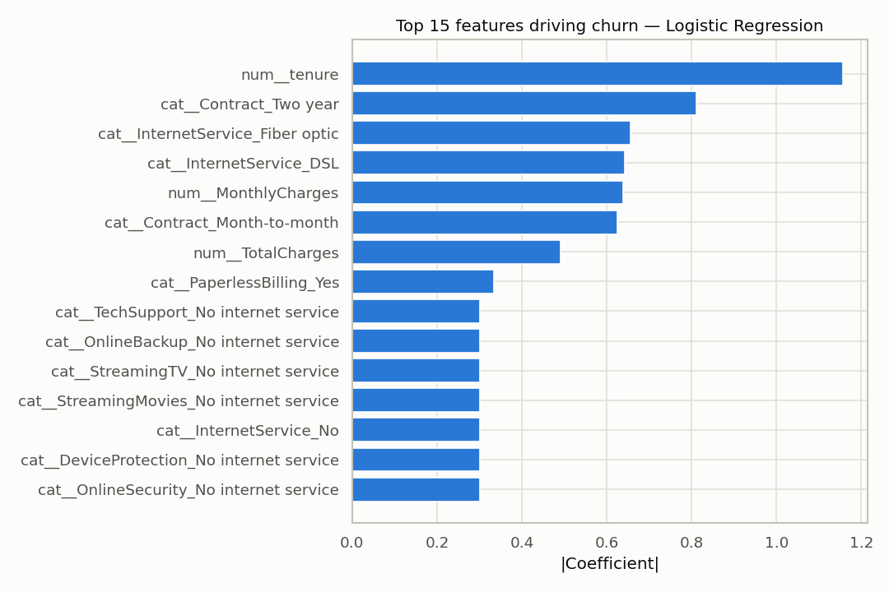

# Telco Customer Churn Prediction — End-to-End ML Project

An independent, end-to-end data science portfolio project: predicting which
telecom customers are likely to churn, and identifying the factors that
drive churn, using the widely-used IBM/Kaggle Telco Customer Churn dataset
(7,043 customers, 21 features, ~26.5% churn rate).

This is a personal portfolio project, built independently — not affiliated
with or performed for any employer.

## What it demonstrates

A complete, properly-documented data science workflow rather than a single
model-fitting step:

1. **Data cleaning** — resolving a text-typed numeric column, confirming a
   plausible root cause for missing values (new customers with zero tenure)
   rather than assuming a data error.
2. **Exploratory data analysis** — churn broken down by contract type,
   tenure, monthly charges, and add-on services, each with a chart.
3. **Feature engineering & preprocessing** — a single `ColumnTransformer`
   pipeline (standard scaling for numeric features, one-hot encoding for
   categorical features) so training and inference use identical
   transformations.
4. **Model comparison** — Logistic Regression, Random Forest, and XGBoost,
   all trained through the same pipeline with class-imbalance handling
   (`class_weight="balanced"` / `scale_pos_weight`), compared on precision,
   recall, F1, and ROC-AUC on a held-out test set.
5. **Evaluation** — confusion matrix, ROC curve, and a feature-importance
   breakdown of the best model.
6. **Business recommendations** — findings translated into concrete,
   actionable retention suggestions.
7. A trained model artifact (`models/churn_model.joblib`) and a short
   inference example showing how a fitted pipeline would score a new
   customer record.

## Key results

| Model | Precision (churn) | Recall (churn) | F1 (churn) | ROC-AUC |
|---|---|---|---|---|
| Logistic Regression | 0.505 | 0.783 | 0.614 | **0.842** |
| Random Forest | 0.533 | 0.759 | 0.626 | 0.842 |
| XGBoost | 0.526 | 0.781 | 0.629 | 0.839 |

All three models landed within 0.003 ROC-AUC of each other. The added
complexity of Random Forest and XGBoost did not meaningfully outperform the
Logistic Regression baseline on this dataset — a realistic finding, and a
reason to prefer the fully-interpretable Logistic Regression model when
explainability to business stakeholders matters.

**What drives churn**, by coefficient magnitude: short tenure, contract
type (month-to-month vs. two-year), fiber-optic internet service, monthly
charges, and the absence of add-on services (online security, tech support,
device protection).

### Business recommendations

- **Contract type is the single strongest churn driver** — month-to-month
  customers churn at ~43%, versus ~11% for one-year and ~3% for two-year
  contracts. Prioritizing contract-upgrade incentives for month-to-month
  customers is the highest-leverage retention action available.
- **Churn risk is concentrated in the first 6 months of tenure** — a
  structured onboarding/check-in program in that window would target the
  highest-risk segment directly.
- **Customers without OnlineSecurity or TechSupport churn noticeably more**
  than those with these add-ons — bundling a trial with new sign-ups is a
  plausible low-cost retention lever.

## Tech stack

Python, pandas, NumPy, scikit-learn, XGBoost, matplotlib, seaborn, Jupyter.

## Project structure

```
telco_churn_prediction/
├── notebooks/
│   ├── churn_prediction.py           # source (jupytext percent format, easy to diff/review)
│   ├── churn_prediction.ipynb        # executed notebook with all outputs
│   └── churn_prediction_view.html    # static HTML export — view without Jupyter
├── data/
│   └── telco_customer_churn.csv
├── models/
│   └── churn_model.joblib            # trained best-model pipeline
├── screenshots/                      # exported chart images
└── requirements.txt
```

## Running it locally

```bash
pip install -r requirements.txt
jupyter nbconvert --to notebook --execute --inplace notebooks/churn_prediction.ipynb
# or open notebooks/churn_prediction.ipynb directly in Jupyter Lab / VS Code
```

## Data source

[IBM Telco Customer Churn sample dataset](https://github.com/IBM/telco-customer-churn-on-icp4d),
a standard, widely-used public benchmark dataset for churn modeling.

## Charts




